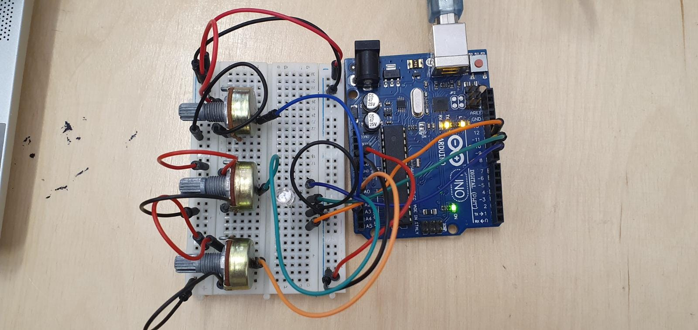

# Introduction To Robotics (2022 - 2023)
This repo includes the homework for the '**Introduction to Robotics**' course, taken in the third year at the _Faculty of Mathematics and Computer Science, University of Bucharest_. Each homework comes with the appropriate details and requirements, as well with the source code, images and videos of the project.

## Homework

 Homework 1 

### Description and requirements

The goal of the first homework was to control an RGB led with three different potentiometers, one for each
color (red, green and blue). The control is done digitally, by mapping the values given by the potentiometers
to RGB values, with the help of the Arduino Uno board.

Here you can find a demo:
https://youtu.be/HXSdGHb5iEo

 Homework 2 

  
### Description and requirements
  
The goal of the second homework was to create a "traffic lights" setup for a crosswalk. There are 2 leds (green and red) for the pedestrians and 3 leds (green, yellow and red) for the cars. The prototype must run through all the 4 stages and simulate a real crosswalk.

  

    
 <h3> States </h3> 

    
 *as written in the laboratory material* 

  
 The system has the following states: 

    <ol>
  <li> State 1 (default, reinstated after state 4 ends): green light for cars,
  red light for people, no sounds. Duration: indefinite, changed by
    pressing the button. </li>
  <li> State 2 (initiated by counting down 8 seconds after a button press):
  the light should be yellow for cars, red for people and no sounds.
  Duration: 3 seconds. </li>
  <li> State 3 (initiated after state 2 ends): red for cars, green for people
  and a beeping sound from the buzzer at a constant interval. Duration:
  8 seconds. </li>
  <li> State 4 (initiated after state 3 ends): red for cars, blinking green
  for people and a beeping sound from the buzzer, at a constant interval,
  faster than the beeping in state 3. This state should last 4
  seconds. </li>
    </ol>
  

  

  
  Here you can find a demo:
https://youtu.be/PK2Td_nJlBc
